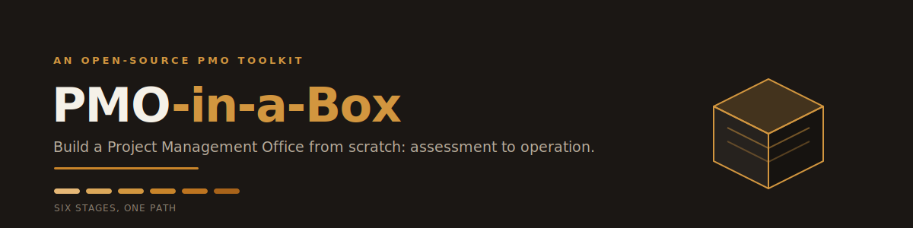
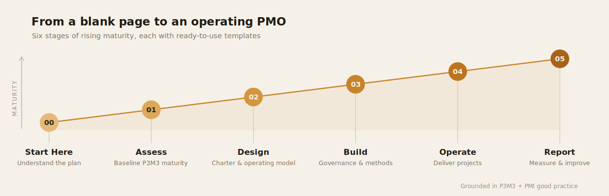

<div align="center">



<br>

[](LICENSE)
[](#whats-inside)
[](docs/methodology.md)
[](CONTRIBUTING.md)

</div>

Standing up a PMO usually means months spent rebuilding the same charters, governance plans, and reporting packs from a blank page. **ITPMO-in-a-Box** hands you the entire journey as editable, brand-neutral templates, organized so you adapt instead of start over.

Every file is sector-neutral, English, and free to reuse under [CC BY 4.0](LICENSE). Open a template, replace the `[Your Organization]` placeholders, and you are moving.

<div align="center">

</div>

## The six stages

| Stage | Folder | What you get | Outcome |
|:---:|---|---|---|
| **00** | [`00-start-here`](00-start-here) | Implementation guide, handbook, establishment deck | Know the plan |
| **01** | [`01-assess`](01-assess) | P3M3 maturity self-assessment, gap and impact analysis | Know where you stand |
| **02** | [`02-design`](02-design) | Charter, operating model, service catalogue, benefits approach | Design the PMO |
| **03** | [`03-build`](03-build) | Governance, methodology, operating and deliverables plans, audit, recruitment | Stand it up |
| **04** | [`04-operate`](04-operate) | 11 project-delivery templates, charter through closure | Run projects |
| **05** | [`05-report`](05-report) | KPI dashboard, status-report pack | Show value and improve |

## Who it is for

PMO leads, IT and transformation managers, and consultants who need to establish or mature a PMO without starting from zero. It also works as a checklist for reviewing a PMO you already run.

## Start here

1. Read [`00-start-here`](00-start-here). The Implementation Guide explains the package and how the stages connect.
2. Baseline your maturity with the P3M3 self-assessment in [`01-assess`](01-assess).
3. Work stages 02 to 05 in order, completing each template as you go.
4. Replace the placeholders below with your own details.

A note on pace: do not attempt everything at once. Pick the stage that matches where you are today.

## Make it yours

Every template uses the same neutral placeholders, so a single Find and Replace makes a template yours in seconds.

| Placeholder | Replace with |
|---|---|
| `[Your Organization]` | Your company or department name |
| `[Your Country]` | Your country |
| `[Your Regulator]` | Your industry regulator, if any |
| `[Partner Organization]` | A partner, vendor, or counterparty |
| `[City]` | A relevant city or location |
| `[Name]` | A person's name (owner, approver) |

<a id="whats-inside"></a>
## What is inside

```
itpmo-in-a-box/
├── 00-start-here/   Guides and establishment deck, read this first
├── 01-assess/       P3M3 maturity self-assessment, gap and impact analysis
├── 02-design/       Charter, operating model, service catalogue, benefits
├── 03-build/        Governance, methodology, operating plan, audit, recruitment
├── 04-operate/      11 project-delivery templates, charter through closure
├── 05-report/       KPI dashboard and status-report pack
└── docs/            Methodology notes and assets
```

Each stage folder has its own short README explaining the files and how to use them.

## Methodology and credits

The toolkit is grounded in **P3M3**, the Portfolio, Programme and Project Management Maturity Model, and in **PMI good practice**, including benefits realization. These frameworks are referenced for guidance, not redistributed. See [`docs/methodology.md`](docs/methodology.md) for an overview and links to the official owners, Axelos / PeopleCert and PMI.

## License and provenance

Released under **[CC BY 4.0](LICENSE)**: free to use and adapt, including commercially, with attribution. For full transparency on how the contents originated, original work versus templates adapted from common industry formats, and trademark notices, see [`NOTICE.md`](NOTICE.md).

These materials are provided for guidance, without warranty. Adapt them to your own policies, legal, and regulatory requirements before use.

## Contributing

Improvements, new templates, and translations are welcome. See [`CONTRIBUTING.md`](CONTRIBUTING.md). One rule holds throughout: keep everything brand-neutral and free of confidential data.

---

<div align="center">

**Curated by [Al-Tamimi](https://github.com/Al-tamimi)**

If this saved you time, a star helps others find it.

</div>
